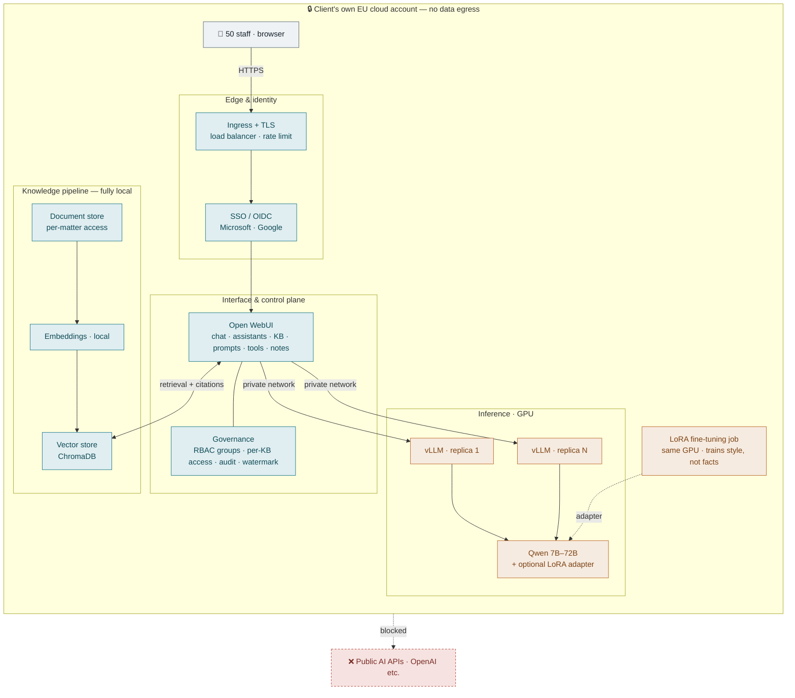
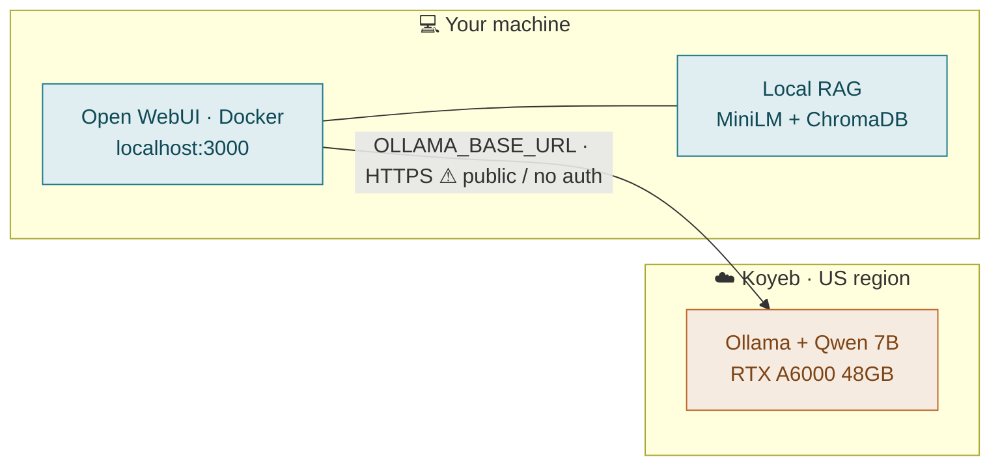

# 08 — Architecture diagrams

Two views of the same idea: the model, the interface, and the knowledge pipeline arranged so
confidential documents never leave infrastructure the client controls.

Colour coding: **teal = application layer · amber = GPU / compute**.

---

## Production — client deployment (target)

Everything runs inside the client's own EU cloud account. Users get a familiar chat experience;
every request is authenticated, authorized, served on private GPUs, and grounded in a local
knowledge pipeline. Nothing egresses to a third-party AI API.

---

## Current PoC — what's running today

A split setup to prove the stack cheaply: the interface runs locally, the model on a rented GPU.
Same shape as production, minus the hardening.

---

## PoC → production, what changes
| PoC (today) | Production (client) |
|---|---|
| Ollama | **vLLM** — continuous batching for real concurrency |
| Koyeb, US region | Client's **own EU cloud account** (data residency) |
| Public, unauthenticated endpoint | **SSO + private networking**, no public model endpoint |
| Single GPU | **Load-balanced vLLM replicas** (concurrency + HA) |
| Local RAG (MiniLM + ChromaDB) | **Same** — the knowledge pipeline is already production-ready |

**Related:** [01-setup](01-setup.md) · [05-capacity-planning](05-capacity-planning.md) · [06-ai-audit-and-stack](06-ai-audit-and-stack.md)
